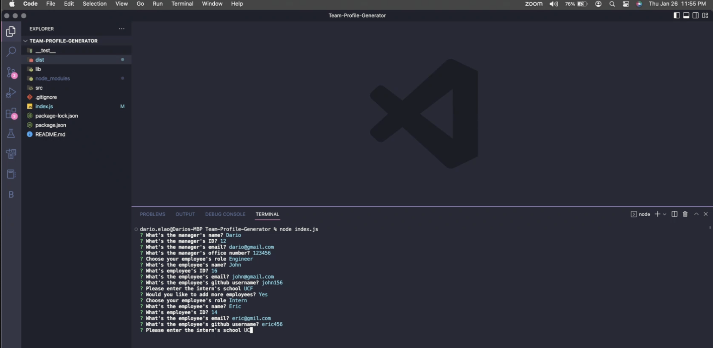
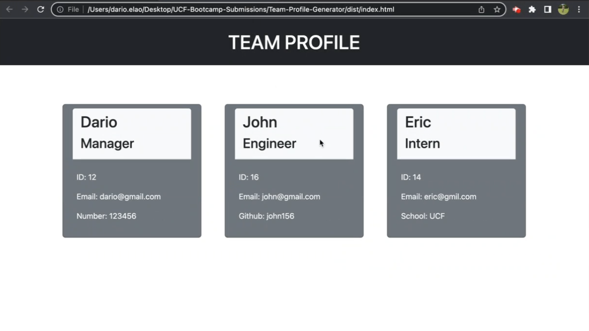

# Team-Profile-Generator

## Description:
This app was designed to build a Team Profile generating a new HTML file based on users input. The app uses inquirer module and node.js as well as OOP

## Table of content:
1. [Installation](#installation)
2. [Usage](#usage)
3. [Username](#username)
4. [Email](#email)

## Installation:
1. Open the index.js file in your terminal with the command: 'node index.js'
2. Answer the questions with your employees information
3. Right click on the new generated index.html to review the content

## Usage:

## License
  None

## Github Username:
  https://github.com/darioelaoao

## Email:
  darioelao@gmail.com